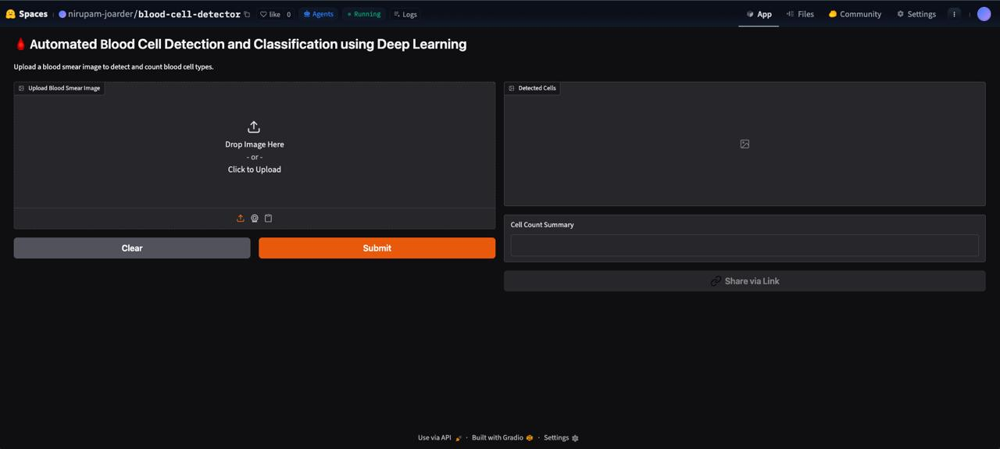
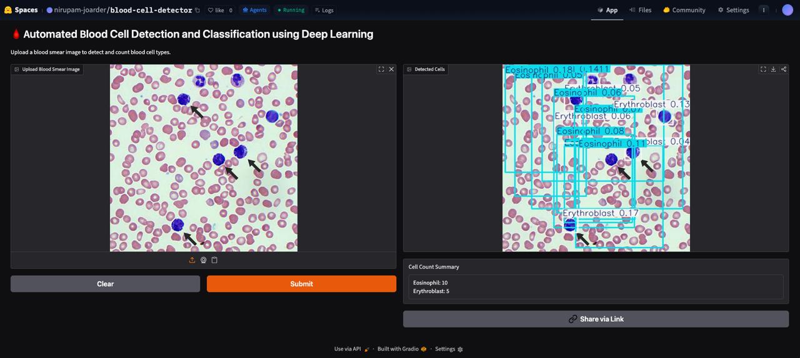
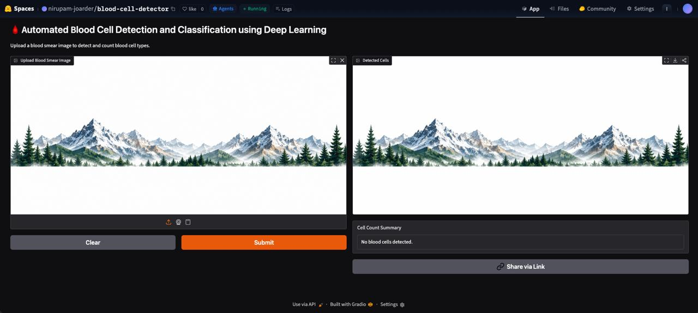

# 🩸 Automated Blood Cell Detection and Classification using Deep Learning

## Overview

This project presents a deep learning-based system for automated detection, classification, and counting of blood cells from microscopic blood smear images. The model is built using YOLOv8 and deployed as an interactive web application using Gradio and Hugging Face Spaces.

The system can identify multiple blood cell types, visualize detections with bounding boxes, and provide automated cell count summaries.

---
## Live Demo

🔗 Hugging Face Space:

https://huggingface.co/spaces/nirupam-joarder/blood-cell-detector

---

## Features

* Automated blood cell detection
* Multi-class blood cell classification
* Cell counting and summary generation
* Bounding box visualization
* Interactive web interface
* Cloud deployment using Hugging Face Spaces

---

## Blood Cell Classes

The model is trained to detect the following blood cell types:

* Basophil
* Eosinophil
* Erythroblast
* Immature Granulocyte (IG)
* Lymphocyte
* Monocyte
* Neutrophil
* Platelets

---

## Technology Stack

* Python
* YOLOv8 (Ultralytics)
* OpenCV
* Gradio
* Hugging Face Spaces

---

## Workflow

1. Upload a blood smear image.
2. YOLOv8 performs cell detection.
3. Detected cells are classified.
4. Bounding boxes are displayed.
5. Cell counts are summarized automatically.

---

## Project Screenshots

### Homepage

### Blood Cell Detection

### Negative Test

---

## Deployment

The project is deployed on Hugging Face Spaces and can perform real-time blood cell detection through a web interface.

---

## Future Improvements

* Larger training dataset
* Improved classification accuracy
* Confidence threshold controls
* Downloadable detection reports
* Batch image processing

---

## Author

**Nirupam Joarder**

Biotechnology Graduate
National Institute of Technology Rourkela
